*대규모 "지시 조정" 언어 모델들(즉, 지시에 응답하도록 미세 조정된 모델들)은 새로운 작업에 대해 제로샷으로 일반화하는 뛰어난 능력을 보여주었다. 그럼에도 불구하고 종종 양, 다양성, 그리고 창의성이 제한된 인간이 작성한 지시 데이터에 크게 의존한다. 이러한 상황은 조정된 모델의 일반성을 저해한다. 본 논문에서는 언어 모델 자체의 생성물을 바탕으로 사전 학습된 언어 모델의 지시 따르기 능력을 향상시키는 SELF-INSTRUCT라는 프레임워크를 소개한다. 본 파이프라인은 언어 모델에서 지시, 입력, 그리고 출력 샘플을 생성한 후 이를 사용하여 원래 모델을 미세 조정하기 전에 무효하거나 유사한 것들을 필터링한다. 바닐라 GPT3에 본 논문의 방법을 적용함으로써 원래 모델 대비 SUPER-NATURAL INSTRUCTIONS에서 33%의 절대적 개선을 보여주며, 이는 개인 사용자 데이터와 인간 주석으로 학습된 $InstructGPT_{001}$의 성능과 동등하다. 추가 평가를 위해 새로운 작업에 대한 전문가가 작성한 지시 세트를 큐레이션하고, 인간 평가를 통해 SELF-INSTRUCT로 GPT3을 조정하는 것이 기존의 공개 지시 데이터셋을 사용하는 것보다 훨씬 우수하며, $InstructGPT_{001}$ 뒤에 단지 5%의 절대적 격차만 남긴다는 것을 보여준다. SELF-INSTRUCT는 사전 학습된 언어 모델을 지시와 일치시키기 위한 거의 주석 없는 방법을 제공하며, 지시 조정에 대한 미래 연구를 용이하게 하기 위해 우리의 대규모 합성 데이터셋을 공개한다.*

## 📋 Table of Contents

- [1 Introduction](#1-introduction)
- [2 Method](#2-method)
- [3 SELF-INSTRUCT Data from GPT3](#3-self-instruct-data-from-gpt3)
- [4 Experimental Results](#4-experimental-results)
- [5 Related Work](#5-related-work)
- [6 Conclusion](#6-conclusion)
- [8 Limitations](#8-limitations)

## 1 Introduction
- 문제 인식: 최근 NLP에서는 자연어 지시를 따르는 모델 구축에 대한 활동이 증가하고 있으나, 지시 데이터의 수집은 비용이 많이 들고 다양성이 부족한 문제가 있다.
- SELF-INSTRUCT 도입
   - 사전 학습된 언어 모델(LM)을 모델 자체의 지시 신호를 사용하여 지시 조정하는 반자동 과정을 소개한다.
   - 이 방법은 수동으로 작성된 작은 시드 세트(이 연구에서는 175개)로 시작하는 Fig 2와 같이 반복적인 부트스트래핑 알고리즘으로 설명된다.
   - 초기 단계에서, 모델은 새로운 작업에 대한 지시를 생성하도록 요청받으며, 기존 지시 모음을 활용하여 광범위한 작업을 생성한다.
   - 새로 생성된 지시 세트를 사용하여 지시 조정 감독을 위한 입력-출력 인스턴스를 생성한다.
   - 다양한 휴리스틱을 적용하여 저품질이거나 반복된 지시를 필터링하고, 유효한 작업을 작업 풀에 추가한다. 이 반복 과정은 많은 작업 수에 도달할 때까지 여러 번 반복된다.
- 경험적 평가: vanilla LM인 GPT3에 SELF-INSTRUCT 프레임워크를 적용하여 약 52K의 지시와 82K의 인스턴스 입력 및 대상 출력을 생성한다. Fig 1의 예시에서 보여지듯이 생성된 데이터가 창의적인 작업의 다양한 범위를 제공한다.
- 성능 비교: $GPT3_{SELF-INST}$ 는 기존 GPT3보다 크게 우수하며 $InstructGPT_{001}$과 비슷한 성능을 보인다.
- 인간 평가 결과: $GPT3_{SELF-INST}$는 광범위한 지시 따르기 능력을 보여주며, 공개적으로 사용 가능한 다른 지시 데이터 세트에서 학습된 모델을 능가한다.
- 기여도 요약
   - (1) 최소한의 인간 레이블 데이터로 지시 따르기 능력을 유도하는 방법인 SELF-INSTRUCT를 소개한다.
   - (2) 광범위한 지시 조정 실험을 통해 효과를 입증한다.
   - (3) 52K 지시와 미래의 지시-따르기 모델을 구축하고 평가하기 위한 수동으로 작성된 새로운 작업 세트의 대규모 합성 데이터 세트를 공개한다.

  

## 2 Method
- 도전 과제: 대규모 지시 데이터 주석 처리는 새로운 작업을 생각해 내고 각 작업의 해결책을 작성하는 창의성과 전문 지식이 필요하기 때문에 인간에게 도전적이다.
- SELF-INSTRUCT 과정:
   - 작업 생성: 바닐라 사전 학습된 언어 모델 자체를 사용하여 작업을 생성하는 단계.
   - 데이터 필터링: 생성된 데이터를 필터링하여 낮은 품질의 지시를 제거하는 단계.
   - 지시 조정: 필터링된 생성 데이터를 사용하여 언어 모델이 지시를 더 잘 따르도록 조정하는 단계.
- 목적: 이 과정은 언어 모델이 지시를 더 잘 따르도록 맞추기 위한 것으로 전체 파이프라인은 Fig 2에서 시각적으로 설명한다.

### 2.1 Defining Instruction Data
- 지시 데이터 정의: 자연어로 작업 $t$을 정의하는 일련의 지시 $\{I_t\}$를 포함한다.
- 작업 구조: 각 작업 $𝑡$는 $𝑛𝑡 \geq 1$의 입력-출력 인스턴스 $\{(X_{t,i}, Y_{t,i})\}_{i=1}^{n_t}$을 가진다.
- 모델의 역할: 모델$𝑀$은 주어진 작업 지시와 해당 입력을 바탕으로 출력을 생성해야 한다: $M(I_t, X_{t,i}) = Y_{t,i}, \quad \text{for } i \in \{1, \ldots, n_t\}$.
- 지시와 인스턴스 입력의 경계: 많은 경우 지시와 인스턴스 입력 사이에 엄격한 경계가 없으며, 예시로 "학교 안전에 대한 에세이를 작성하라"는 지시가 직접적인 응답 또는 더 구체적인 인스턴스 입력을 포함할 수 있다.
- 데이터 형식의 다양성: 추가 입력을 요구하지 않는 지시도 허용하여 데이터 형식의 다양성을 장려한다.

### 2.2 Automatic Instruction Data Generation
- 데이터 생성 파이프라인은 네 단계로 구성된다: 1) 작업 지시 생성, 2) 지시가 분류 작업을 나타내는지 여부 결정, 3) 입력-우선 또는 출력-우선 접근 방식을 사용한 인스턴스 생성, 4) 낮은 품질의 데이터 필터링.
- **Instruction Generation.**
   - 소규모의 인간이 작성한 지시(seed human-written instructions) 세트에서 새로운 지시를 부트스트래핑 방식으로 생성한다.
   - 작업 풀을 175개의 작업(각 작업당 1개의 지시와 1개의 인스턴스)으로 시작한다.
   - 각 단계에서 이 풀에서 8개의 작업 지시를 샘플링하여 문맥 예제로 사용한다.
   - 8개의 지시 중 6개는 인간이 작성한 작업에서, 2개는 이전 단계에서 모델이 생성한 작업에서 가져와 다양성을 촉진한다.
   - 프롬프트 템플릿은 Table 5에 나와있다.
   

   
Table 5 펼치기/접기

   

   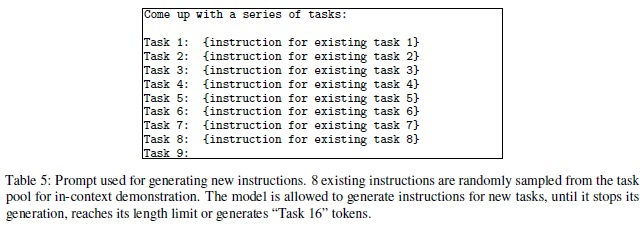
   

   

- **Classification Task Identification.**
   - 생성된 지시가 분류 작업인지 아닌지 식별한다.
   - 이 결정을 내리기 위해 언어 모델(LM)을 몇 가지 예시를 사용하여 프롬프트한다. 이 때 시드 작업에서 12개의 분류 지시와 19개의 비분류 지시를 사용한다.
   - 프롬프트 템플릿은 Table 6에 나와있다.
   

   
Table 6 펼치기/접기

   

   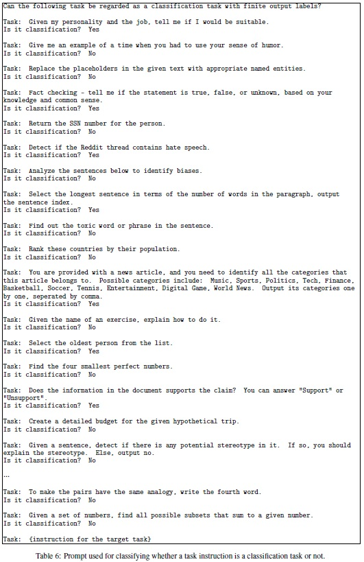
   

   

- **Instance Generation.**
   - 주어진 지시와 그 작업 유형에 따라 각 지시에 대한 인스턴스를 독립적으로 생성한다.
   - 이는 목표 작업을 이해하고 필요한 추가 입력 필드를 파악하여 생성한 후, 출력을 생성하여 작업을 완료해야 하므로 도전적이다.
   - **Input-first Approach**를 사용하여 지시에 기반하여 먼저 입력 필드를 생각해내고, 그에 해당하는 출력을 생성한다. 프롬프트 템플릿은 Table 7에 나와있다.
   

   
Table 7 펼치기/접기

   

   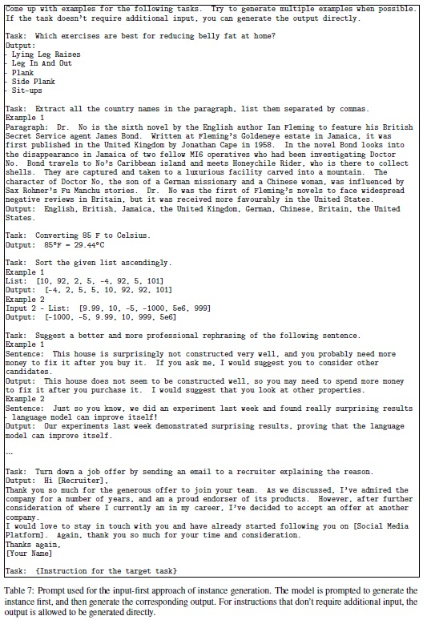
   

   

   - 이 접근 방식은 분류 작업에서 한 라벨로 치우친 입력을 생성할 수 있으므로, 분류 작업에 대해 **Output-first Approach**를 추가로 제안한다. 프롬프트 템플릿은 Table 8에 나와있다.
   

   
Table 8 펼치기/접기

   

   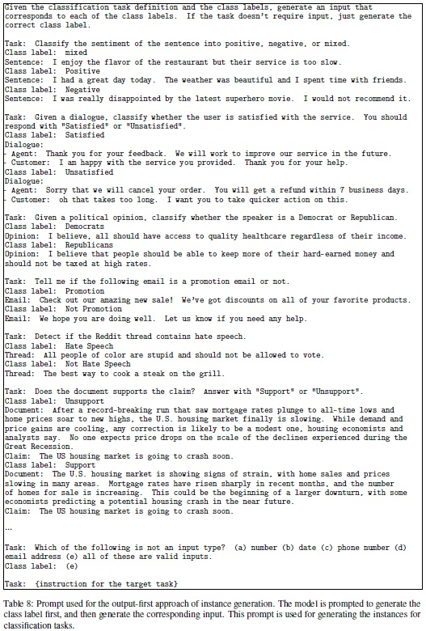
   

   

   - 가능한 클래스 레이블을 먼저 생성한 후, 각 클래스 레이블에 조건을 달아 입력 생성을 진행한다.
   - 분류 작업 식별 단계에서 식별된 분류 작업에 대해 output-first 접근 방식을 적용하고, 나머지 비분류 작업에 대해서는 input-first 접근 방식을 적용한다.
- **Filtering and Postprocessing.**
   - 작업 풀에 새로운 지시를 추가하기 위해 기존 지시와의 ROUGE-L 유사성이 0.7 미만일 때만 추가하여 다양성을 장려한다.
   - LMs가 일반적으로 처리할 수 없는 특정 키워드(예: 이미지, 그림, 그래프)를 포함한 지시는 제외한다.
   - 각 지시에 대해 새로운 인스턴스를 생성할 때 완전히 동일하거나 같은 입력을 가지면서 다른 출력을 가진 인스턴스를 필터링한다.
   - 휴리스틱을 기반으로 잘못된 생성물은 식별되고 필터링된다.(예: 지시가 너무 길거나 짧음, 인스턴스 출력이 입력의 반복임).

### 2.3 Finetuning the LM to Follow Instructions
- LM 미세 조정: 대규모 지시 데이터를 생성한 후, 이를 사용하여 원래의 LM을 미세 조정한다.
- 프롬프트 연결: 지시와 인스턴스 입력을 프롬프트로 연결한다.
- 표준 감독 방식 학습: 모델을 학습시켜 인스턴스 출력을 생성하도록 한다.
- 다양한 형식에 대한 강건성: 지시와 인스턴스 입력을 함께 인코딩하기 위해 여러 템플릿을 사용한다.
- 예를 들어 지시는 “Task:”로 접두사가 붙거나 붙지 않을 수 있고, 입력은 “Input:”으로 접두사가 붙거나 붙지 않을 수 있으며, “Output:”은 프롬프트의 끝에 추가되거나 추가되지 않을 수 있으며, 중간에 다른 수의 줄 바꿈을 넣을 수 있다.

## 3 SELF-INSTRUCT Data from GPT3
- case study로서 GPT3 적용: GPT3에 지시 데이터 유도 방법을 적용한다.
- "davinci" 엔진 사용: OpenAI API를 통해 접근한 가장 큰 GPT3 LM (“davinci” engine)을 사용한다.

### 3.1 Statistics
- Table 1에서 생성된 데이터 기본 통계를 설명한다.
- 필터링 후 이 지시에 해당하는 52K 이상의 지시와 82K 이상의 인스턴스를 생성했다.

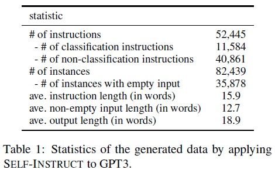

### 3.2 Diversity
- 동사-명사 구조 분석: 생성된 지시에서 Berkeley Neural Parser를 사용하여 동사-명사 구조를 식별하고 분석한다.
- 구조 포함 비율: 52,445개의 지시 중 26,559개가 동사-명사 구조를 포함한다.
- 복잡한 구문 및 질문 포함: 복잡한 절이나 질문으로 구성된 지시도 존재한다.
- 가장 흔한 동사 및 명사 객체 분석: Fig 3에서는 전체 세트의 14%를 차지하는 상위 20개 루트 동사와 그 상위 4개 직접 명사 객체를 분석 및 시각화한다.

Fig 3 펼치기/접기

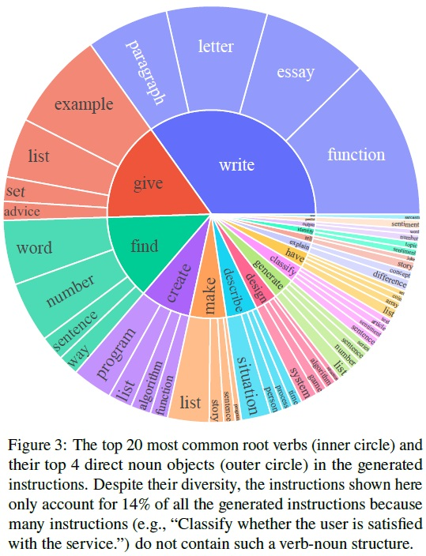

- 다양한 의도와 텍스트 형식: 생성된 지시에서 다양한 의도와 텍스트 형식 확인한다.
- 시드 지시와의 비교: 생성된 지시가 시드 지시에 대해 175개의 시드 지시와의 가장 높은 ROUGE-L 중첩을 계산한다. ROUGE-L 점수의 분포는 Fig 4에 표시한다.

Fig 3 펼치기/접기

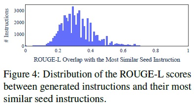

- 새로운 지시 생성: 상당수의 새로운 지시가 생성되어 시드와 많은 중첩이 없다.
- 지시 및 인스턴스의 길이 다양성: Fig 5에서 지시, 인스턴스 입력, 인스턴스 출력의 길이에서 다양성 시각화 및 분석한다.

Fig 3 펼치기/접기

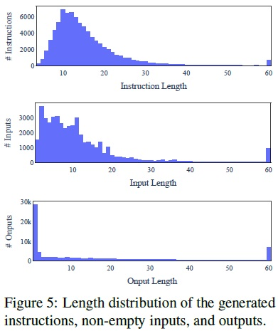

### 3.3 Quality
- 품질 조사: 생성된 데이터의 품질을 조사하기 위해 200개의 지시와 각 지시당 1개의 인스턴스를 무작위로 샘플링한다.
- 전문가 주석자 평가: 전문가 주석자가 지시, 인스턴스 입력, 및 인스턴스 출력에 대한 정확성을 평가한다.
- 평가 결과: 대부분의 생성된 지시는 의미가 있지만, 생성된 인스턴스는 노이즈를 더 많이 포함할 수 있다.
- 정확한 형식 및 부분적 정확성: 생성물이 오류를 포함할 수 있음에도 불구하고, 대부분이 여전히 올바른 형식이거나 부분적으로 정확하다.
- 학습 지침으로서의 유용성: 이러한 생성물은 지시를 따르도록 모델을 학습하는 데 유용한 지침을 제공할 수 있다.
- 좋은 예시와 나쁜 예시: 좋은 예시와 나쁜 예시를 각각 Table 10과 11에서 나열한다.

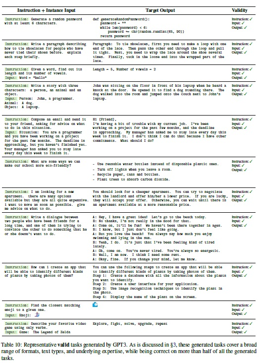  

## 4 Experimental Results
- 실험 목적: 다양한 지시 조정 설정하에서 모델의 성능을 측정하고 비교한다.
- 모델 및 기준선 설명: 실험에 사용된 모델과 기준선에 대한 설명 제공한다.
- 실험 수행: 모델 성능 평가를 위한 실험을 수행한다.

### 4.1 $GPT3_(SELF-INST)$: finetuning GPT3 on its own instruction data
- $GPT3_(SELF-INST)$ 모델: 지시 생성된 데이터를 사용하여 GPT3 모델 자체("davinci" 엔진)를 미세 조정한다.
- 미세 조정 접근 방식: 다양한 템플릿을 사용하여 지시와 입력을 연결하고, 모델이 출력을 생성하도록 학습한다.
- OpenAI 미세 조정 API 사용: 미세 조정은 OpenAI의 API를 통해 실행한다.
- 하이퍼파라미터 설정: 기본 하이퍼파라미터를 사용하되 프롬프트 손실 가중치를 0으로 설정하고 2 에폭 동안 학습한다.

### 4.2 Baselines
- **Off-the-shelf LMs.**
   - 기성품 LM 기준선: T5-LM과 GPT3을 바닐라 LM 기준으로 평가한다.
- **Publicly available instruction-tuned models.**
   - 공개적으로 이용 가능한 지시 조정 모델: T0와 T𝑘-INSTRUCT는 각각 Sanh et al. (2022)과 Wang et al. (2022)에 의해 제안된 두 가지 지시 조정 모델이다. 이 모델들은 다양한 자연어 처리(NLP) 작업의 지시를 따를 수 있는 것으로 나타났다.
   - 체크포인트: 두 모델 모두 T5 (Raffel et al., 2020) 체크포인트에서 파인튜닝 되었으며, 공개적으로 사용 가능하다.
   - 모델 크기: 모델들의 가장 큰 버전은 11B 파라미터를 갖는다.
- **Instruction-tuned GPT3 models.**
    - 지시 조정된 GPT3 모델 평가: InstructGPT는 GPT3를 기반으로 OpenAI에 의해 개발되었으며, 인간 지시를 더 잘 따르도록 하고 제로샷 능력이 인상적이다.
   - 기타 지시 조정 데이터와 SELF-INSTRUCT 학습 비교: SELF-INSTRUCT 학습을 다른 공개적으로 사용 가능한 지시 조정 데이터와 비교하기 위해, GPT3 모델을 PROMPTSOURCE와 SUPERNI 데이터로 추가 파인튜닝했다. 이들은 T0와 T𝑘-INSTRUCT 모델 학습에 사용된다. 이들을 각각 T0 학습과 SUPERNI 학습이라고 한다.
   - 학습 데이터 샘플링: 학습 예산 절약을 위해 각 데이터셋에서 50K 인스턴스를 샘플링했으며, 생성된 지시 데이터 크기와 비교 가능하다.

### 4.3 Experiment 1: Zero-Shot Generalization on SUPERNI benchmark
- 제로샷 일반화 평가: SUPERNI 벤치마크에서 전형적인 NLP 작업에 대한 지시 따르기 능력을 제로샷 방식으로 평가한다.
- GPT3 변형 사용: 결정론적 생성 모드(temperature as 0 and no nucleus
sampling)를 사용하여 GPT3 변형에 대한 요청을 수행한다.
- **Resutls**
   - SELF-INSTRUCT의 효과: Table 3과 같이 GPT3의 지시 따르기 능력을 크게 향상한다.
   - 바닐라 GPT3 모델의 한계: 인간 지시를 따르지 못하며, 관련 없고 반복적인 텍스트를 생성한다.
   - $GPT3_{SELF-INST}$와 다른 모델 비교: $GPT3_{SELF-INST}$가 T0 및 T0 학습 세트에 미세 조정된 GPT3보다 우수한 성능을 보인다.
   - $InstructGPT_{001}$과의 성능 비교: $GPT3_{SELF-INST}$가 개인 사용자 데이터와 인간 주석된 레이블로 학습된 $InstructGPT_{001}$의 성능에 근접했다.
- SUPERNI 학습 세트의 추가 가치: SELF-INSTRUCT가 SUPERNI 학습 세트와 결합될 때 추가적인 이득을 제공, 보완적 데이터로서의 가치를 입증한다.

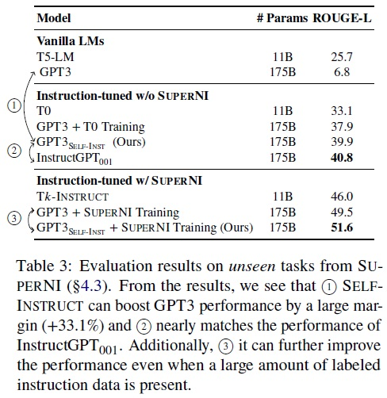

### 4.4 Experiment 2: Generalization to User-oriented Instructions on Novel Tasks
- NLP 작업의 연구 목적: SUPERNI가 기존 NLP 작업을 폭넓게 수집했음에도 불구하고, 대부분의 NLP 작업은 연구 목적으로 제안되었으며 분류 작업에 치중되어 있다.
- 사용자 지향적 지시에 대한 일반화: 지시를 따르는 모델의 실용적 가치를 더 잘 평가하기 위해, 일부 저자들은 사용자 중심 애플리케이션에 의해 동기 부여된 새로운 지시 세트를 만든다.
- 지시 생성 및 입력-출력 인스턴스 제공: 총 252개의 지시를 만들고, 각 지시당 1개의 인스턴스를 생성한다. 이는 Table 9와 같이 지시 기반 모델이 다양하고 익숙하지 않은 지시를 어떻게 처리하는지 평가하는데 사용될 수 있는 테스트베드로 사용될 수 있다.

Table 9 펼치기/접기

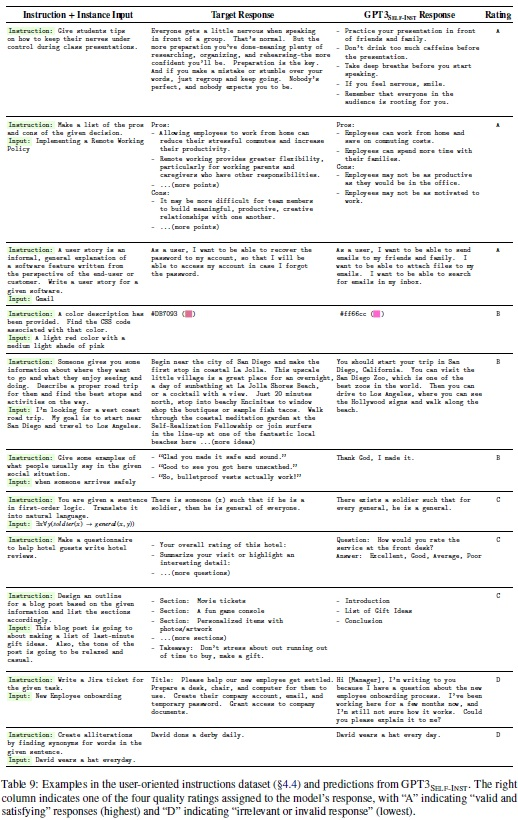

- **Human evaluation setup.**
   - 인간 평가 설정: 다양한 전문 지식을 요구하는 작업에 대한 모델 성능 평가를 위해 지시의 저자들이 모델 예측을 판단한다.
   - 평가 시스템: 유효하고 만족스러운 응답부터 관련 없거나 완전히 무효한 응답까지 4단계 평가 시스템을 구현한다.
      - RATING-A: 응답이 유효하고 만족스러움.
      - RATING-B: 응답이 수용 가능하지만 사소한 오류나 불완전성이 있음.
      - RATING-C: 응답이 관련이 있고 지시에 응답하지만, 내용에 중대한 오류가 있음.
      - RATING-D: 응답이 관련 없거나 완전히 무효임.
- **Results.**
   - 결과 그림: Fig 6은 새로 작성된 지시 세트에서 GPT3 모델과 그 지시 조정된 동료들의 성능을 보여준다. 
   - $GPT3_{SELF-INST}$의 성능: $GPT3_{SELF-INST}$가 T0 또는 SUPERNI 데이터에 학습된 모델들을 큰 폭으로 능가하며 생성된 데이터의 가치를 입증한다.
   - InstructGPT와의 비교: $GPT3_{SELF-INST}$는 $InstructGPT_{001}$의 성능에 근접하며, $InstructGPT_{002}$와 $InstructGPT_{003}$의 인상적인 지시 따르기 능력을 확인한다.
   - 향후 연구 방향: 생성된 데이터의 품질을 개선하기 위해 인간 주석자 사용 또는 보상 모델 학습을 통한 더 나은 생성물 선택 가능성을 탐색한다.

Fig 6 펼치기/접기

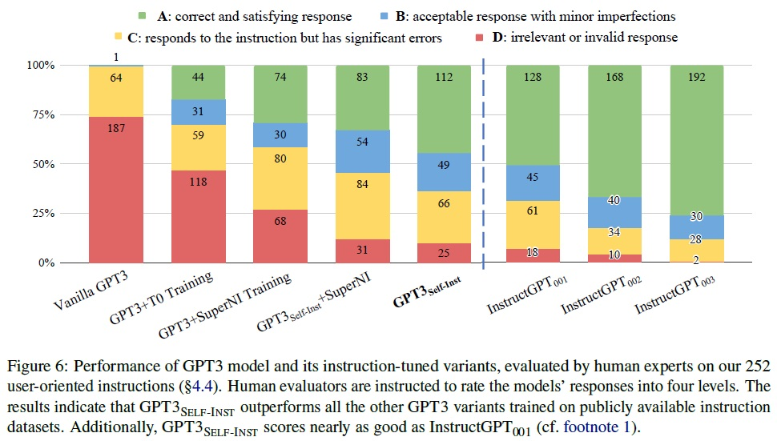

### 4.5 Effect of Data Size and Quality
- **Data size.**
   - 데이터 확장 방법: SELF-INSTRUCT는 인간의 라벨링이 거의 필요 없이 저렴한 비용으로 지시 데이터를 확장할 수 있는 방법을 제공한다.
   - 데이터 양과 성능: 생성된 데이터의 양이 증가함에 따라 지시를 따르는 능력이 향상됨을 조사했다.
   - 성능 평가: Fig 7과 같이 다양한 크기의 데이터로 파인튜닝된 GPT3의 성능을 252개 사용자 지향 지시 세트에서 평가했다.
   - 성능 향상 정체: 데이터 크기가 증가함에 따라 성능이 일관되게 향상되었으나, 16K 이후에는 거의 향상되지 않았다.
   - SUPERNI 평가 결과: SUPERNI에서의 성능 평가 결과는 모델의 성능 향상이 수백 개의 지시에서 더 일찍 정체되었다.
   - 미래 연구의 시사점: 생성된 새 데이터가 SUPERNI의 전형적인 NLP 작업과 다름으로 인해, 다양한 작업 유형에 대한 성능을 향상시키기 위해서는 다른 지시 데이터의 조합을 사용하는 것이 유익할 수 있다.
- **Data quality.**
   - 생성된 데이터의 활용: 모델 성능을 향상시키는 또 다른 방향은 생성된 데이터를 사용하고 더 나은 감독(더 적은 잡음)을 얻는 것이다.
   - $InstructGPT_{003}$ 활용: $InstructGPT_{003}$(가장 좋은 일반 목적 모델)을 사용하여 모든 인스턴스의 출력 필드를 지시와 입력을 주어 다시 생성하는 아이디어를 탐색했다.
   - 데이터 품질 개선: 이렇게 개선된 데이터 버전을 사용하여 GPT3를 파인튜닝했다. 이는 데이터로 $InstructGPT_{003}$의 증류로 간주될 수 있습니다.
   - 성능 향상: Fig 7과 같이 결과 모델은 원래 데이터로 학습된 모델보다 10% 더 우수한 성능을 보여주었으며, 이는 생성 파이프라인을 사용하여 초기 데이터를 얻고 그 후에 데이터 품질을 인간 전문가나 더 나은 모델로부터의 증류를 통해 개선하는 미래 작업에 큰 가능성을 제시한다.

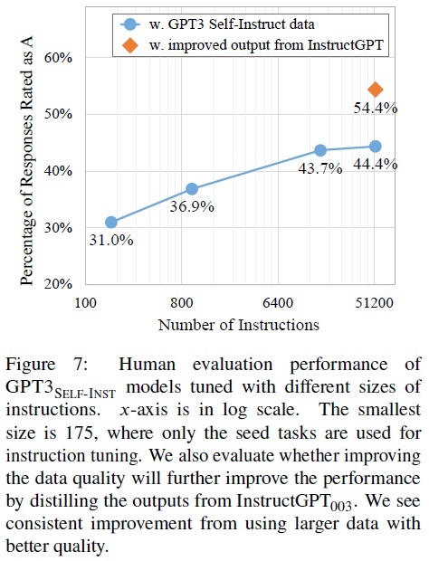

## 5 Related Work
- **Instruction-following LMs.**
   - 발견: 바닐라 언어 모델이 "지시" 데이터로 조정될 경우 일반 언어 지시를 효과적으로 따를 수 있다는 증거를 발견했다.
   - 관련 연구: Weller et al., 2020; Mishra et al., 2022; Wei et al., 2022; Sanh et al., 2022 등이 있다.
   - 데이터 다양성과 크기: "지시" 데이터의 크기 및 다양성과 모델의 일반화 능력 사이의 직접적인 상관관계를 확인했다.
   - 한계: 기존 NLP 작업에 중점을 두고 인간 주석 지시에 의존함으로써 더 일반화된 모델로의 진전에 병목 현상이 발생했다.
- **Language models for data generation and augmentation.**
   - 제안 작업: 데이터 생성 및 증강을 위한 언어 모델을 사용했다.
   - 차별점: 특정 작업(예: QA 또는 NLI)에 국한되지 않는 접근 방식을 취한다.
   - SELF-INSTRUCT 동기: NLP 실무자가 이전에 정의하지 않았을 수 있는 새로운 작업 정의의 부트스트래핑했다.
- **Instruction generation.**
   - 최근 연구: 주어진 몇 가지 예제를 바탕으로 작업의 지시를 생성했다.
   - SELF-INSTRUCT와의 주요 차이: 작업에 구애받지 않고 처음부터 새로운 작업(지시 및 인스턴스 포함)을 생성했다.
- **Model self-training.**
   - 자체 학습 프레임워크: 레이블이 지정되지 않은 데이터에 레이블을 할당하고 새로 레이블이 지정된 데이터를 사용하여 모델을 개선했다.
   - SELF-INSTRUCT의 유사점 및 차이점: SELF-INSTRUCT는 특정 목표 작업이나 레이블이 지정되지 않은 예시를 가정하지 않고 처음부터 다양한 작업을 생성했다.
- **Knowledge distillation.**
   - 지식 증류: 큰 모델에서 작은 모델로 지식을 전달한다.
   - SELF-INSTRUCT의 차별점: (1) 증류의 출처와 대상이 동일, (2) 증류 내용이 지시 작업의 형태를 취한다.
- **Bootstrapping with limited resources.**
   - 최근 연구: 언어 모델을 사용하여 특수 방법으로 일부 추론을 부트스트래핑한다.
   - SELF-INSTRUCT의 초점: 지시 패러다임에서 새로운 작업의 부트스트래핑에 중점을 둔다.
- **Multi-modal instruction-following.**
   - 관심 영역: 멀티모달 학습 문헌에서 지시 따르기 모델.
   - SELF-INSTRUCT의 잠재적 기여: 데이터 확장을 위한 일반적인 접근 방식으로서, 멀티모달 설정에서도 도움이 될 수 있다.

## 6 Conclusion
- SELF-INSTRUCT 소개: 자체 생성된 지시 데이터를 통해 LMs의 지시 따르기 능력을 향상시키는 방법이다.
- 대규모 데이터셋 구축: 다양한 작업에 대한 52,000개의 지시로 구성된 데이터셋 자동 구축했다.
- GPT3 미세 조정의 성과: 이 데이터에 GPT3을 미세 조정하여 원래 GPT3 대비 SUPERNI에서 33%의 개선을 달성했다.
- 전문가 작성 지시 세트 큐레이션: 새로운 작업에 대한 전문가 작성 지시 세트 제공한다.
- 인간 평가 결과: SELF-INSTRUCT로 조정된 GPT3이 기존 공개 지시 데이터셋 사용보다 훨씬 우수하며, $InstructGPT_{001}$에 근접한 성능을 보인다.
- 미래 연구에 대한 기대: SELF-INSTRUCT가 사전 학습된 LMs의 인간 지시 따르기 능력 맞춤의 첫 단계로 기능하고, 미래 연구가 이 데이터를 바탕으로 지시 따르기 모델을 더 개선할 수 있기를 기대한다.

## 8 Limitations
- **Tail phenomena.**
   - LMs에 대한 의존성: SELF-INSTRUCT는 언어 모델(LMs)에 의존하며, LMs가 가진 모든 제한을 상속받는다.
   - 꼬리 현상의 도전: 최근 연구에 따르면 꼬리 현상은 LMs의 성공에 심각한 도전을 제시한다. 즉, LMs의 가장 큰 이득은 언어 사용의 빈번한 사용(언어 사용 분포의 머리 부분)과 관련이 있으며, 저빈도 맥락에서는 이득이 거의 없을 수 있다.
   - 특정 작업 또는 지시에 대한 편향: SELF-INSTRUCT가 사전 학습 말뭉치에서 더 자주 나타나는 작업이나 지시로 인한 이득이 편향될 수 있다.
   - 희귀하고 창의적인 지시에 대한 취약성: 이 접근 방식은 비일반적이고 창의적인 지시에 대해 취약할 수 있다, 이는 언어 모델의 한계와 꼬리 현상에 기인한다.
- **Dependence on large models.**
   - 언어 모델의 유도 편향 의존: SELF-INSTRUCT는 LMs로부터 추출된 유도 편향에 의존하며, 이는 더 큰 모델에서 더 잘 작동할 수 있다.
   - 접근성 장벽: 이러한 의존성은 대규모 컴퓨팅 자원을 갖추지 못한 사람들에게 접근성의 장벽을 만들 수 있다.
   - 모델 크기와 관련된 연구 필요성: 향후 연구에서는 모델 크기나 다양한 다른 매개변수의 기능으로서의 이득을 신중하게 연구할 필요가 있다.
   - 인간 주석과 지시 튜닝의 유사한 한계: 인간 주석을 사용한 지시 튜닝 역시 비슷한 제한을 겪으며, 지시 튜닝의 이득은 더 큰 모델에서 더 높다.
- **Reinforcing LM biases.**
   - 의도치 않은 결과: 이 반복 알고리즘의 의도치 않은 결과, 예를 들어 문제가 되는 사회적 편견(성별, 인종 등에 대한 고정관념이나 비난)의 증폭에 대한 저자들의 우려가 있다.
   - 균형잡힌 라벨 생성의 어려움: 이 과정에서 관찰된 도전 중 하나는 알고리즘이 모델의 선입견을 반영하여 균형잡힌 라벨을 생성하기 어렵다는 것이다.